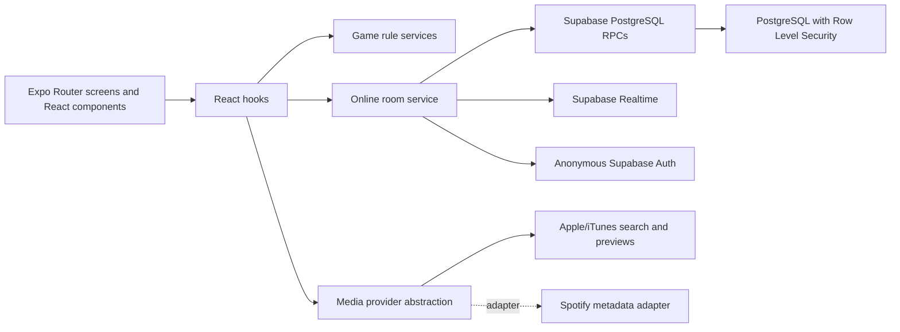

# Song Wars

[](https://github.com/gnp1465/song-wars/actions/workflows/verify.yml)

<p align="center">
  
</p>

Song Wars is an iOS-first multiplayer party game where a judge chooses a topic, players submit songs that match it, and the group decides a winner through a knockout bracket. Round winners earn points and become the judge for the next round.

The project is a native React Native and Expo application, not a mobile web app. Song previews play inside the game so players can compare tracks without leaving the room flow.

## Project Status

The local and online game loops are playable end to end. The online flow was manually verified across an iPhone 14, an iPad, and an iOS simulator running on a MacBook Pro.

- Local offline game with room setup, submissions, bracket judging, scoring, and replay
- Anonymous online rooms with six-digit codes, QR invites, and no login screen
- Realtime lobby, settings, topic, submission, bracket, and score synchronization
- Host-authorized room controls and server-authoritative game actions
- Apple/iTunes song search and localized in-app preview playback
- First-to-N scoring, judge rotation, byes, and duplicate-song protection
- Reconnect, room resume, member removal, room closing, and audio cleanup behavior
- Remote playback foundations: preview caching, server-clock offset math, scheduled events, and locked progress UI

Persistent accounts, game history, payments, and production-grade synchronized listening are intentionally outside the current resume-project scope.

## How It Works

1. A host creates a temporary online room and shares its six-digit code or QR invite.
2. Guests join with temporary display names through anonymous Supabase sessions.
3. The judge submits a topic such as `Beach vibes`.
4. Every non-judge player searches, previews, and submits the configured number of songs.
5. The backend builds the bracket and the judge selects each matchup winner.
6. The round winner earns a point and becomes the next judge.
7. The first player to reach the room's point target wins the game.

## Architecture



The client handles presentation and immediate feedback, while PostgreSQL RPC functions enforce important multiplayer rules. Raw database responses are mapped into domain types before they reach the UI.

### Important Design Decisions

| Decision | Reason |
| --- | --- |
| Anonymous authentication | Party guests can join quickly while every device still receives a secure backend identity. |
| Server-authoritative RPC actions | Clients cannot bypass host, judge, scoring, duplicate-song, or room-capacity rules with direct table writes. |
| Row Level Security | Supabase checks which room data an authenticated anonymous user may read. |
| Membership separate from Presence | A temporary network disconnect does not remove a player from the room. |
| Media provider interface | Search metadata and preview delivery can come from different providers without changing bracket logic. |
| Domain model mapping | React components use stable app types instead of depending on raw database JSON. |
| Local game preserved | Core rules and UI remain demonstrable without a backend connection. |

Read the complete layer-by-layer explanation in [docs/ARCHITECTURE.md](docs/ARCHITECTURE.md).

## Technology

| Area | Technology |
| --- | --- |
| Mobile application | React Native, Expo, Expo Router |
| Language | TypeScript |
| Backend | Supabase, PostgreSQL, PostgreSQL RPC functions |
| Authentication | Persisted anonymous Supabase sessions |
| Live updates | Supabase Realtime and Presence |
| Audio | Expo AV, Apple/iTunes preview streams, Expo File System caching |
| Data protection | Row Level Security and authenticated RPC authorization |
| Testing | TypeScript checks, Node-based rule tests, hosted Supabase integration checks |
| Continuous integration | GitHub Actions |

## Verification

Run the complete local quality gate:

```bash
npm run verify
```

This checks app configuration, secrets, accessibility surfaces, documentation, EAS configuration, TypeScript, game rules, media behavior, online state mapping, and the committed database contract.

Run the hosted Supabase integration test separately:

```bash
npm run check:online-room
```

The hosted check creates separate anonymous clients and verifies room creation, permissions, settings, submissions, judging, scoring, replay, and cleanup against the deployed backend.

Manual verification evidence is recorded in:

- [Device pass log](docs/DEVICE_PASS_LOG.md)
- [Supabase migration pass log](docs/SUPABASE_MIGRATION_PASS_LOG.md)
- [Frontend completion audit](docs/FRONTEND_COMPLETION_AUDIT.md)

## Run Locally

Prerequisites:

- Node.js and npm
- Expo Go or Xcode with an iOS simulator
- A Supabase project only if you want to test online rooms

Install dependencies:

```bash
npm install
```

Copy the environment template and add the project's public Supabase URL and anon key:

```bash
cp .env.example .env
```

Never place a Supabase service-role key in the mobile app.

Start Expo:

```bash
npm start
```

For backend setup and ordered migrations, follow [docs/ONLINE_ROOM_SETUP.md](docs/ONLINE_ROOM_SETUP.md).

## Repository Map

```text
app/                    Expo Router routes and navigation entry points
src/components/         Reusable interface components
src/hooks/              Reusable React state and side-effect behavior
src/screens/            Local game screens
src/services/game/      Bracket, room, submission, and scoring rules
src/services/media/     Provider-independent search and preview handling
src/services/online/    Online room actions and state helpers
src/services/supabase/  Typed Supabase client configuration
src/tests/              Executable rule and behavior checks
supabase/migrations/    Database schema, RLS policies, and RPC functions
docs/                   Architecture, testing, learning, and release records
```

## Engineering Notes

- [Learning glossary](docs/GLOSSARY.md) explains the framework and architecture terms used by the project.
- [Learning log](docs/LEARNING_LOG.md) records the reasoning behind incremental features.
- [Diagnostics](docs/DIAGNOSTICS.md) explains local error reporting and sensitive-value redaction.
- [Prototype status](docs/PROTOTYPE_STATUS.md) separates completed behavior from future product work.
- [Privacy policy](docs/PRIVACY_POLICY.md) documents the data behavior of the current prototype.

## Current Limitations

- Song availability depends on the user's Apple/iTunes storefront and available preview catalog.
- The Spotify provider is an architectural adapter; the current player flow uses Apple/iTunes search and previews.
- Realtime channels are public for beta event delivery because hosted Supabase does not allow dashboard users to own `realtime.messages`; room data and game mutations remain protected by RPC authorization and table RLS.
- Remote synchronized playback is a working foundation, not a production listening-party guarantee across every network condition.
- Temporary anonymous rooms are not recoverable after the app session is lost.
- The project is not distributed through TestFlight or the App Store because that requires a paid Apple Developer membership.
